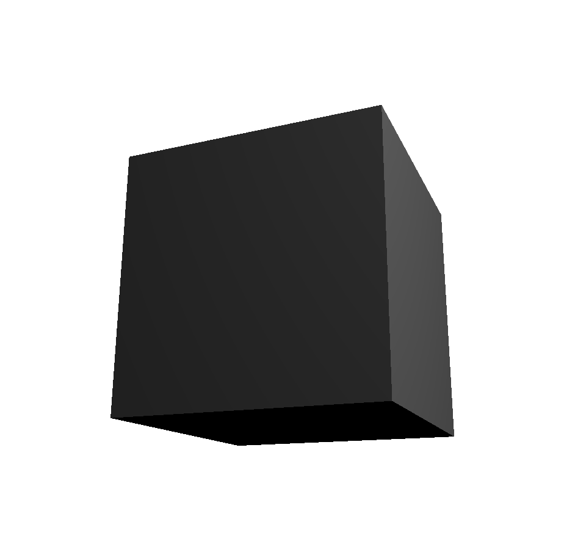
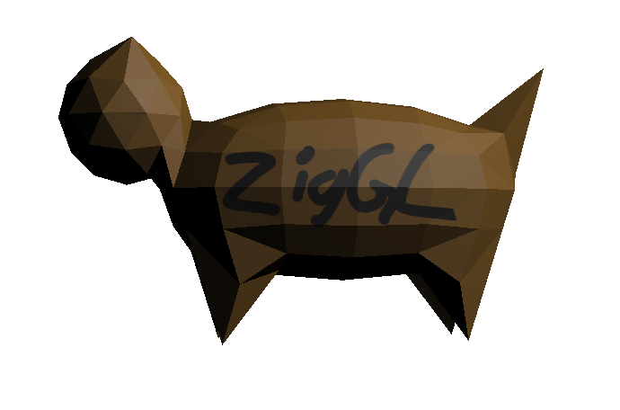
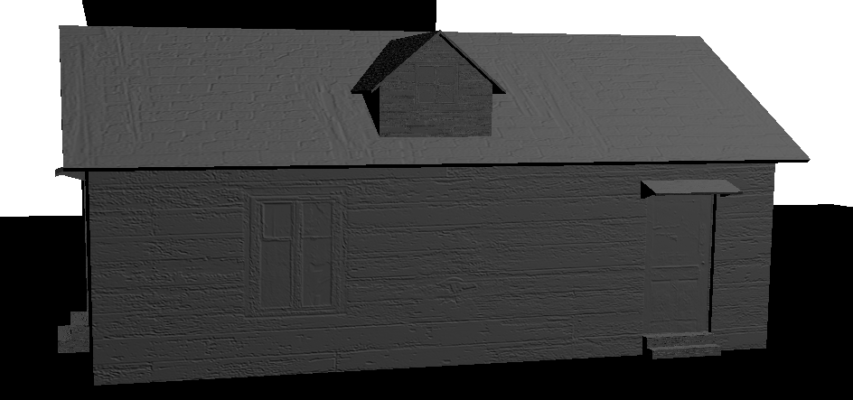
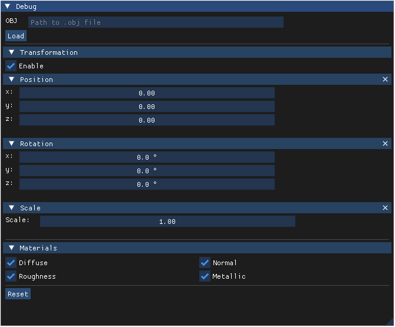

# ZigGL

A learning project for OpenGL using the Zig programming language.

This project is a Zig implementation of a relatively simple OpenGL object loader and viewer. The Application supports loading and rendering of most Wavefront `.obj` files (not all forms of formation supportet yet). Aswell as the corresponding `.mtl` files for materials. Following material maps are currently supported: 
- Diffuse map
- Normal map
- Roughness map
- Metallic map

These maps can be toggled on and off in the application by pressing `ctrl + o` to open a ImGui overlay. In the overlay you can also load new `.obj` models.

## Getting Started
### Prerequisites
1. Zig `0.13.0`
2. Execute the `libs.bat` script to download the required C libraries
3. Execute `zig build` to build the project

### Running
```bash
zig build run
```

## Screenshots
**Default cube:**



---
**Default cat:**
Integrated model, can be loaded by importing "cat" in the overlay.



---
**Map showcase:**
Model with Roughness and Bump map applied.



---
**Overlay:**
ImGui overlay to load new models, transform existing model and toggle maps.


